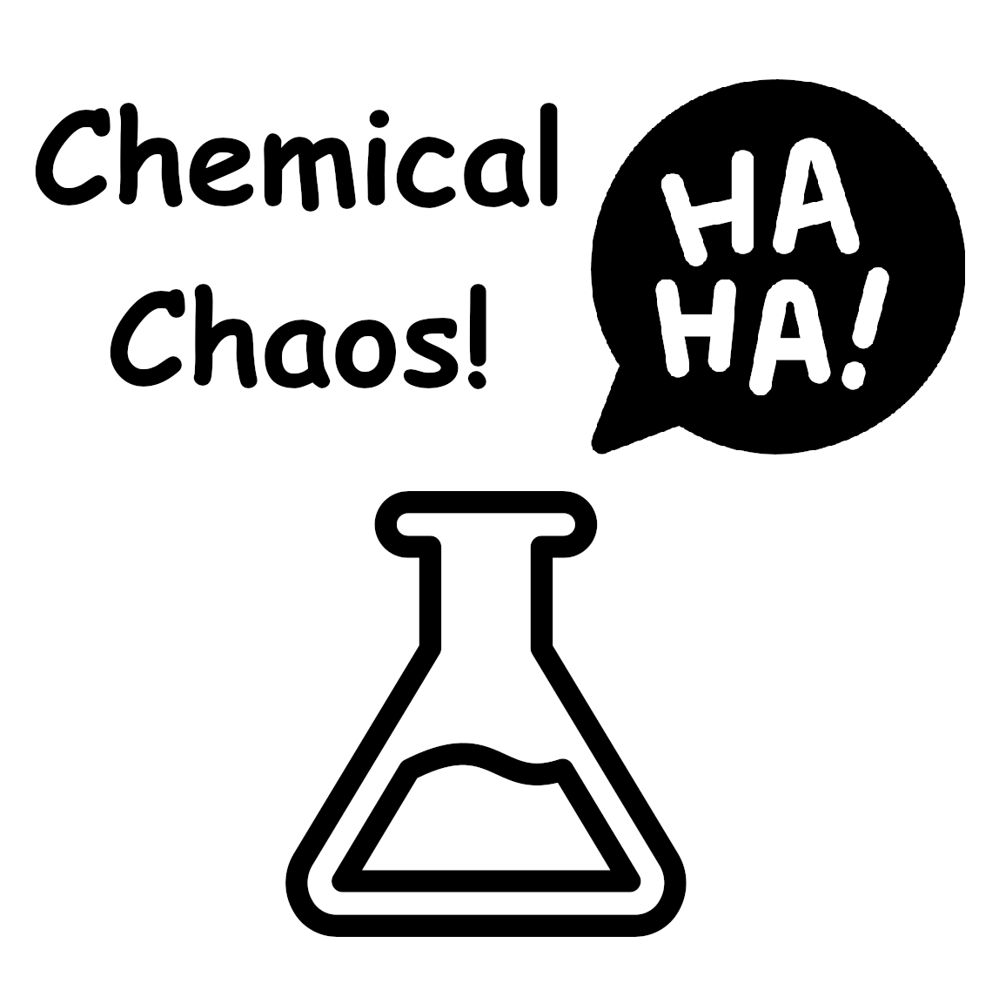

# Chemical Chaos!

A Card Game by Keegan Noecker & Sherri Noecker (Wheeler)

Global Game Jam 2024

https://globalgamejam.org/games/2024/chemical-chaos-2

Chemical Chaos! is a printable casual party card game designed to be quick to learn and full of laughs for groups of 3-6 players. This game was created for the 2024 Global Game Jam (globalgamejam.org) by 12 year old Keegan Noecker and his mom Sherri Noecker as part of the Windsor Hackforge GGJ jam site.

## Overview

  * **Number of Players:** 3-6
  * **Avg Play Time:** 60 minutes
  * **Ages:** 8 and up
  * **Licence:** Creative Commons Attribution-NonCommercial-ShareAlike 4.0 International
  * **Required Components:**
    * Chemical Chaos! printable playing cards (included)
    * Score counting tokens or a pen & paper (not included)

## How To Use This Repository

  * To play the game, download the PDF files in the `/Game/` directory. Print and cut out the cards. Full, printable instructions are included.
  * To adapt the game, the source files are in `/Source/` including GIMP image files and LibreOffice Draw and Doc files are also included.

## Objective

To be the first player to collect the needed ingredients and create 5 recipes (4 for a shorter game).

## Quick Start

  * Shuffle the cards and place them face down in the center of the play area.
  * Deal 8 starting cards to each player.
  * Players play in turns clockwise; drawing a new card, exchanging up to 3 cards, then playing any number of recipes they have the ingredients for. Players draw an extra 2 cards for every recipe played, and they score 1 Chemistry Point for each recipe created.
  * Most recipes affect other players, any card with a Side Effect is placed in front of the affected player until it is cured or removed by another card effect.
  * All players must obey all Side Effects affecting any player.
  * Any player who catches another player not obeying an applicable Side Effect may take a random card from the caught player.
  * First player to score 5 Chemistry Points (craft 5 recipes) wins.
  * Any player who runs out of cards completely, is eliminated. They may watch for other players not obeying Side Effects in order to take a card and get back in the game.
Contents
  * 29 Recipe Cards
  * 76 Ingredient Cards
  * 4 Instant Cards